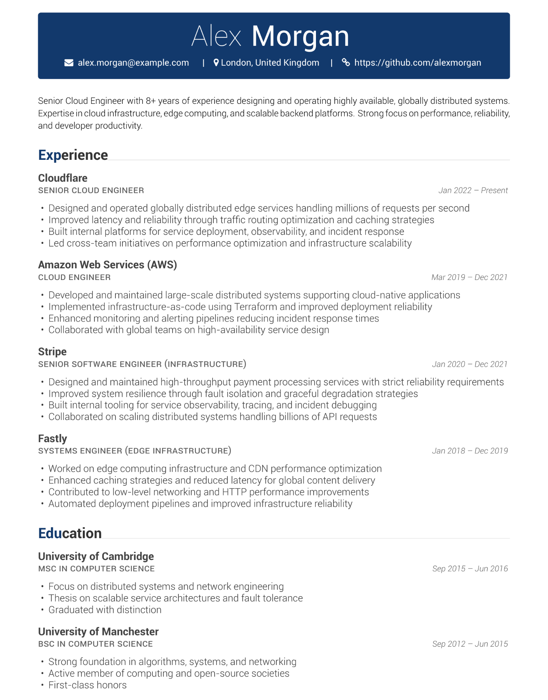
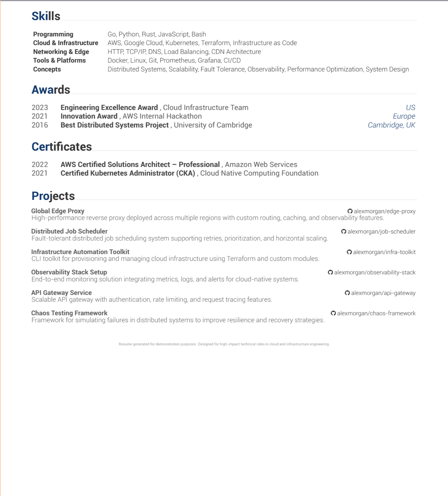

<p align="center">
  
</p>

<h1 align="center">CV as Code</h1>

<p align="center">
  Generate clean resumes from structured YAML with LaTeX.
</p>

## Features

- 📄 Write your CV in simple YAML files  
- ✅ Catch mistakes before building  
- 🧩 Fully customizable layout  
- 🖨️ Clean and professional PDF output  
- ⚡ Build everything with one command  
- 📚 Manage multiple CV versions easily  
- 🔐 Keep sensitive data encrypted if needed  

## Usage

#### Make sure you have all dependencies, or run:

```bash
nix develop
```

#### Add or edit a CV

Create or edit any YAML file in:

```text
cv/<name>.yaml
```

#### Encryption (Optional)

```bash
sops cv/cv.yaml
```

#### Build

```bash
task build
```

CVs are generated under `build/`.

## Preview

|                Page 1                 |                 Page 2                 |
| :------------------------------------: | :------------------------------------: |
|  |  |

## Ackoledgement

* To: [Lissy93](https://github.com/Lissy93/cv) for giving me the idea
* To: [Awesome-CV](https://github.com/posquit0/Awesome-CV/tree/master) for the template
